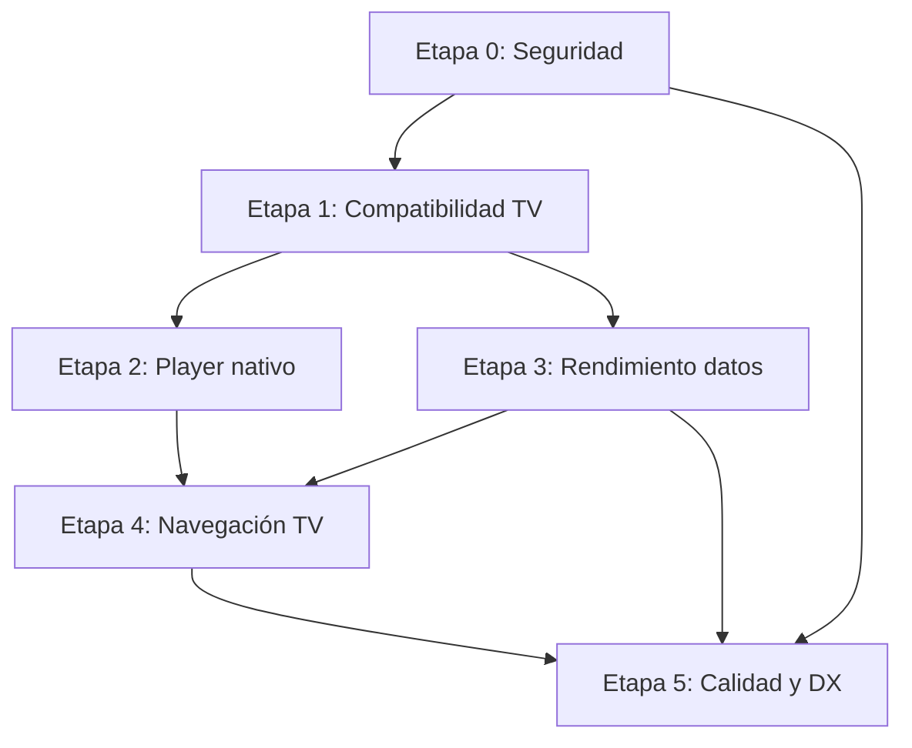

# Auditoría Consolidada y Plan de Acción — appVideo

**Proyecto:** appVideo (Smart TV OTT — Samsung Tizen / LG webOS / Web)  
**Stack:** React 18 + Vite 7 + Zustand 5 + React Router 7 + hls.js + video.js  
**Fecha de consolidación:** 2026-06-05  
**Fuentes:** `AUDITORIA.md`, `AUDITORIA_TECNICA.md`, `AUDITORIA_TECNICA_3.md` + verificación directa del código

---

## Resumen ejecutivo

El proyecto tiene una arquitectura conceptualmente correcta (engines separados por plataforma, preload centralizado, adaptadores Samsung/LG, worker EPG inline). Sin embargo, acumula **más de 40 hallazgos** verificados que afectan directamente la experiencia en Smart TV 2019: pantalla negra en arranque, reproducción degradada sin engines nativos, congelamiento de UI por algoritmos ineficientes, navegación TV frágil y riesgos de seguridad por credenciales en código.

Este documento consolida todos los hallazgos, indica su estado de verificación en el código actual, y propone un plan de resolución en **5 etapas** ordenadas por impacto y riesgo de regresión.

### Métricas de verificación

| Categoría | Total hallazgos | Confirmados | Parciales / matizados | Incorrectos / desactualizados |
|-----------|----------------|-----------|----------------------|------------------------------|
| Compilación y despliegue | 5 | 4 | 1 | 0 |
| Player y engines nativos | 10 | 10 | 0 | 0 |
| Rendimiento de datos | 8 | 7 | 1 | 0 |
| Navegación TV | 9 | 8 | 1 | 0 |
| Estado y arquitectura React | 8 | 8 | 0 | 0 |
| Seguridad y sesión | 6 | 5 | 1 | 0 |
| Build, dependencias y DX | 7 | 6 | 0 | 1 |
| **Total** | **~53** | **~48** | **~4** | **~1** |

---

## Correcciones a los informes originales

Antes del plan de acción, se documentan hallazgos que los informes originales describen de forma imprecisa:

| Hallazgo original | Corrección tras revisión de código |
|-------------------|-------------------------------------|
| **H-30** — `buildAll.js` sin manejo de errores | **Incorrecto.** El script ya ejecuta `process.exit(failed > 0 ? 1 : 0)` al finalizar. |
| **H-36** — `src/docs/` dentro de `src/` | **Desactualizado.** Ese directorio ya no existe en el repositorio. |
| **H-24** — UDID inseguro en `udidCrypto.js` | **Ruta incorrecta.** El problema está en `src/cv/udid.js` (`Math.random()`). `udidCrypto.js` es descifrado RSA/AES, no generación de UDID. |
| **3.4 / DataCloneError** en `epgNormalize.worker.js` | **Parcialmente desactualizado.** El worker en producción es `epgWorkerClient.js` (inline Blob) y devuelve timestamps numéricos sin funciones. El archivo `epgNormalize.worker.js` existe pero no se usa. La inconsistencia de tipos entre worker (números) y fallback (objetos `valueOf`) sigue siendo real. |
| **1.1 / H-28** — Target `chrome 61` incorrecto | **Depende del hardware target.** Si el objetivo incluye LG webOS 4.5 (Chromium 53), el target debe bajarse. Si el target son TVs 2019+ con Chromium 61+, la config actual es coherente con sus comentarios internos. Se recomienda validar con hardware real antes de cambiar. |
| **H-13** — "6+ listeners keydown" | **Subestimado.** Hay **15+** archivos con `addEventListener('keydown', { capture: true })`. |
| **H-25** — Múltiples intervals de validación | **Parcialmente mitigado.** `startSessionValidator()` tiene guard `if (validationIntervalId) return`. El riesgo persiste si no se llama `stopSessionValidator()` al desmontar. |

---

## Etapa 0 — Bloqueantes de seguridad y despliegue

**Duración estimada:** 1 semana  
**Objetivo:** Eliminar riesgos que no deben llegar a producción ni a repositorios remotos.  
**Estado:** ✅ Implementado (2026-06-05) — pendiente: crear `.env.local` con tokens reales y rotar credenciales expuestas en historial git.

### Archivos creados o modificados en Etapa 0

| Archivo | Cambio |
|---------|--------|
| `src/config/resolveBrandToken.js` | Nuevo — resuelve tokens desde `VITE_BRAND_TOKEN_*` |
| `src/config/brands.js` | Tokens vacíos; `getBrandConfig()` inyecta token desde env |
| `vite.config.js` | Inyecta token en builds de marca única desde env |
| `.env.example` | Plantilla de variables de entorno |
| `scripts/check-brand-secrets.js` | Validación CI: falla si hay tokens hardcodeados |
| `scripts/buildAll.js` | Ejecuta `check-brand-secrets` antes del build |
| `package.json` | Scripts `check:secrets` y hooks `prebuild:*` |
| `src/utils/userSession.js` | `sessionId` cifrado con AES (migración legacy automática) |
| `.gitignore` | Excluye `azcopy.exe` |
| `azcopy.exe` | Removido del tracking de git (`git rm --cached`) |

### 0.1 Tokens de API en código fuente (H-35) — CRÍTICO

- **Archivo:** `src/config/brands.js`
- **Problema:** Tokens de API (`token: "DDXXHySyAfrKgBczmhBk"`, etc.) commiteados en texto plano para cada marca.
- **Impacto:** Exposición de credenciales de producción; cualquier persona con acceso al repo puede autenticarse contra el backend.
- **Resolución planificada:**
  1. Extraer tokens a variables de entorno (`VITE_BRAND_TOKEN_*`) por marca, inyectadas en build time vía `vite.config.js` / `define`.
  2. Rotar todos los tokens expuestos en el historial de git.
  3. Añadir validación en CI que falle si `brands.js` contiene strings que parezcan tokens hardcodeados.
  4. Documentar en README el flujo de `.env.local` para desarrollo.

### 0.2 `azcopy.exe` en el repositorio (H-29)

- **Archivo:** `azcopy.exe` (raíz, ~60 MB)
- **Problema:** Ejecutable binario en el repo; infla clones, dispara alertas de seguridad en CI.
- **Resolución planificada:**
  1. Añadir `azcopy.exe` a `.gitignore`.
  2. Eliminar del tracking con `git rm --cached azcopy.exe`.
  3. Si se necesita en CI, descargarlo en el pipeline con script (`scripts/install-azcopy.ps1`).

### 0.3 SessionId y credenciales en localStorage sin cifrado (H-23)

- **Archivo:** `src/utils/userSession.js`
- **Problema:** `sessionId`, `username`, `password` y `udid` almacenados en texto plano en `localStorage`.
- **Resolución planificada:**
  1. Cifrar valores sensibles con `crypto-js` o WebCrypto AES-GCM (ambas dependencias ya disponibles).
  2. Evaluar si `password` debe persistirse (idealmente solo en memoria de sesión).
  3. Usar `sessionStorage` para `sessionId` si no debe sobrevivir al cierre de la app.

---

## Etapa 1 — Compatibilidad TV y arranque en dispositivos 2019

**Duración estimada:** 1–2 semanas  
**Objetivo:** Garantizar que la app arranca y transpila correctamente en Tizen 4+ y webOS 4+.

### 1.1 Target de transpilación Chromium (1.1 / H-28)

- **Archivo:** `vite.config.js` (líneas 54–59, 78)
- **Problema:** Plugin legacy con `targets: ['chrome 61']` y `modernTargets: ['chrome 69']`. El chunk "moderno" puede contener sintaxis no soportada en TVs con Chromium 53–61 (optional chaining, async/await nativo, etc.).
- **Estado actual:** Ya hay mitigación parcial (`target: 'es2015'`, `cssTarget: 'chrome61'`, Terser `ecma: 5`).
- **Resolución planificada:**
  1. Validar en hardware real (LG webOS 4.5 Chromium 53, Samsung Tizen 5 Chromium 63) qué sintaxis falla.
  2. Si se confirma incompatibilidad: bajar `targets` a `['chrome 53']` y `modernTargets` a `['chrome 63']`.
  3. Añadir `es-check` al pipeline de CI para verificar que ningún chunk contiene sintaxis no soportada.
  4. Ejecutar `vite build` y analizar ambos chunks (legacy + modern) con herramienta de verificación ES.

### 1.2 Scripts nativos de fabricante ausentes (1.2)

- **Archivo:** `index.html`
- **Problema:** No incluye `<script src="$WEBAPIS/webapis/webapis.js">` (Tizen) ni `webOSTV.js` (webOS). Sin ellos, `window.webapis` y `window.webOS` pueden no estar disponibles.
- **Resolución planificada:**
  1. Crear script de detección en `index.html` que inyecte condicionalmente según UserAgent o variable de build (`VITE_PLATFORM`).
  2. Para empaquetado Tizen: incluir referencia a `$WEBAPIS/webapis/webapis.js` en el `config.xml` del widget.
  3. Para empaquetado webOS: incluir `webOSTV.js` en el IPK o cargarlo desde CDN interno.
  4. Mantener fallback graceful: si las APIs no están disponibles, loggear y usar WebEngine.

### 1.3 Detección de plataforma solo por UserAgent (H-22)

- **Archivo:** `src/player/engines/resolveEnginePlatform.js`
- **Problema:** Selección de engine basada en UA string. UserAgents de TV son inconsistentes entre firmwares.
- **Resolución planificada:**
  1. Añadir detección secundaria por presencia de APIs: `window.tizen`, `window.webapis?.avplay`, `window.webOS?.service`.
  2. Loggear en producción qué engine se seleccionó y por qué criterio (UA vs API).
  3. Permitir override manual vía query param `?engine=lg|samsung|web` (ya existe parcialmente).

---

## Etapa 2 — Reproductor nativo y reproducción en TV

**Duración estimada:** 2–3 semanas  
**Objetivo:** Activar y robustecer los engines nativos Samsung/LG para hardware decoding y DRM.

### 2.1 Adaptadores nativos desactivados (2.1)

- **Archivo:** `src/config/brands.js`
- **Problema:** `player.nativeAdaptersEnabled: false` en las 6 marcas. Siempre se usa WebEngine + HLS.js incluso en TV.
- **Impacto:** Demux en JS satura CPU en Full HD; DRM Widevine/PlayReady falla sin CDM nativo.
- **Resolución planificada:**
  1. Crear perfil de build `VITE_TV_DEPLOY=true` que active `nativeAdaptersEnabled: true`.
  2. Mantener `false` para builds web/navegador como modo seguro.
  3. Probar en hardware real Samsung y LG antes de activar en producción.
  4. Implementar fallback automático a WebEngine si el engine nativo falla en init.

### 2.2 Sin try-catch en AVPlay Samsung (2.2)

- **Archivo:** `src/player/engines/samsung/SamsungEngine.js` (líneas 156–179)
- **Problema:** `nativePlay()`, `nativePause()`, `nativeSeek()` llaman a AVPlay sin control de excepciones. AVPlay tiene máquina de estados estricta.
- **Resolución planificada:**
  1. Envolver cada llamada nativa en `try-catch`.
  2. Mapear errores a `emitNativeError()` con código de estado AVPlay.
  3. Añadir guard de estado: no llamar `play()` si no está en estado `READY` o `PLAYING`.

### 2.3 Fuga de listener AVPlay en destrucción (2.3)

- **Archivo:** `src/player/engines/samsung/SamsungEngine.js` (líneas 210–229)
- **Problema:** `nativeDestroy()` limpia `this.avplayListener = null` pero no llama `api.setListener(null)`.
- **Impacto:** Zapping rápido deja callbacks huérfanos que disparan en instancias destruidas.
- **Resolución planificada:**
  1. Antes de `stop()`/`close()`, llamar `api.setListener({})` o `api.setListener(null)` si `hasSetListener`.
  2. Añadir test manual de zapping (10+ cambios de canal en <5 segundos).

### 2.4 Pipeline de video LG no liberado (2.4)

- **Archivo:** `src/player/engines/lg/LgEngine.js` (líneas 194–217)
- **Problema:** `nativeDestroy()` no hace `video.src = ""` + `video.load()`. TVs 2019 tienen un solo pipeline de decodificación HW.
- **Resolución planificada:**
  1. En `nativeDestroy()`: `video.pause()`, `video.removeAttribute('src')`, `video.load()`.
  2. Esperar evento `emptied` antes de anular referencias.
  3. Probar secuencia: reproducir canal A → zapping a canal B → VOD → volver a live.

### 2.5 Carrera DRM Luna en webOS (2.5)

- **Archivo:** `src/player/engines/lg/LgEngine.js` (línea 212)
- **Problema:** `_webosUnloadDrmClient().catch(() => {})` es fire-and-forget. Nuevo canal puede cargar DRM antes de que termine el unload anterior.
- **Resolución planificada:**
  1. Convertir el ciclo destroy→load en cola serializada con `async/await`.
  2. Mantener `_drmTransitionPromise` como mutex: cada `nativeLoad` espera a que el unload previo termine.
  3. Timeout de 5 s en unload; si falla, forzar reset del cliente DRM.

### 2.6 Sin timeout en inicialización de SDK nativo (H-20)

- **Archivos:** `SamsungEngine.js`, `LgEngine.js`
- **Problema:** Si el SDK no responde, la app queda en carga indefinida.
- **Resolución planificada:**
  1. Envolver `tryActivateNativeAdapter()` en `Promise.race` con timeout de 10 segundos.
  2. Si timeout: loggear, emitir error, fallback a WebEngine.
  3. Mostrar mensaje de error al usuario (no solo `console.error`).

### 2.7 Errores de reproducción silenciados (H-18)

- **Archivo:** `src/contexts/PlayerContext.jsx` (líneas 481–533)
- **Problema:** Errores de `engine.init()` y `play()` solo van a `console.error`. El usuario no ve indicación de fallo.
- **Resolución planificada:**
  1. En el `.catch()` de la IIFE de `play()`, actualizar `setState({ error: err, isLoading: false })`.
  2. Mostrar overlay de error en `PlayerHud` cuando `state.error` no sea null.

### 2.8 Stale closures en handlers del engine (H-19)

- **Archivo:** `src/contexts/PlayerContext.jsx` (línea 437)
- **Problema:** `useEffect([])` con handlers que acceden a `state` via closures del mount inicial. `eslint-disable` confirma que se ignoran dependencias.
- **Resolución planificada:**
  1. Crear refs para cada handler: `handleTimeRef`, `handleErrorRef`, etc.
  2. Actualizar `.current` en cada render.
  3. Los listeners del engine leen siempre de `.current`.
  4. Eliminar el `eslint-disable`.

### 2.9 `video.js 6.6.3` EOL (H-21)

- **Archivo:** `package.json`, `src/player/engines/web/WebEngine.js`
- **Problema:** Versión de 2018, sin parches de seguridad, ~180 KB gzipped. Se usa activamente.
- **Resolución planificada:**
  1. Evaluar si `WebEngine` puede operar solo con `hls.js` + `<video>` nativo (sin video.js).
  2. Si se mantiene: actualizar a video.js 8.x con plugin hls.js compatible.
  3. Medir impacto en bundle antes y después.

### 2.10 `JSON.stringify` para comparar tracks (H-05)

- **Archivo:** `src/contexts/PlayerContext.jsx` (línea 32)
- **Problema:** `tracksSnapshotsEqual` serializa arrays completos en cada evento `TRACKS_CHANGE`.
- **Resolución planificada:**
  1. Comparación estructural: longitud + IDs de tracks + `selectedAudioId` + `selectedTextId`.
  2. Sin serialización JSON.

---

## Etapa 3 — Rendimiento de datos y UI en TV

**Duración estimada:** 2–3 semanas  
**Objetivo:** Eliminar congelamientos de UI por algoritmos ineficientes y timers agresivos.

### 3.1 Mutación directa de streams en el store (H-01)

- **Archivos:** `src/services/tvDataService.js`, `src/store/preloadStore.js`
- **Problema:** `ensureStreamPlaybackUrl()` muta `stream.url` in-place. Objetos en Zustand deben ser inmutables.
- **Resolución planificada:**
  1. Refactorizar a `return { ...stream, url: normalizedUrl }`.
  2. Reemplazar `.forEach(ensureStreamPlaybackUrl)` por `.map(ensureStreamPlaybackUrl)`.

### 3.2 Timeout EPG de 5 minutos + maxChannels ignorado (H-02)

- **Archivo:** `src/store/preloadStore.js` (línea 16, línea 180)
- **Problema:** `LOADING_TIMEOUT_MS = 300000` (5 min). `maxChannels: total` ignora `epg.rowsOnInit` de la marca.
- **Resolución planificada:**
  1. Reducir timeout a 60–90 segundos.
  2. Usar `brandConfig.epg.rowsOnInit` como `maxChannels` (ya soportado en `tvDataService.js`, solo corregir la llamada en preloadStore).
  3. Mostrar progreso visible al usuario durante la carga EPG.

### 3.3 EPG secuencial canal por canal (3.3)

- **Archivo:** `src/services/epgService.js` (líneas 203–228)
- **Problema:** `for (...) { await fetchEPG(...) }` — 10 canales = 10 requests secuenciales (3–5 s acumulados).
- **Resolución planificada:**
  1. Implementar pool de concurrencia (lotes de 3–5 con `Promise.all`).
  2. Respetar `maxChannels` de la config de marca.
  3. Añadir `AbortController` para cancelar si el usuario navega fuera.

### 3.4 Inconsistencia de tipos EPG worker vs fallback (3.4)

- **Archivos:** `src/services/epgService.js`, `src/workers/epgWorkerClient.js`, `src/workers/epgNormalize.worker.js`
- **Problema:** Worker inline devuelve timestamps `number`; fallback devuelve objetos `{ valueOf: () => ms }`. Archivo `epgNormalize.worker.js` huérfano con funciones no clonables.
- **Resolución planificada:**
  1. Estandarizar todo a timestamps numéricos (`number`) en worker y fallback.
  2. Eliminar `epgNormalize.worker.js` (código muerto).
  3. Verificar que componentes UI (`EpgCards`, `epgTime.js`) funcionan con números (ya tienen checks defensivos).

### 3.5 Catchup O(T × G × E) (3.1)

- **Archivo:** `src/store/preloadStore.js` (líneas 515–563)
- **Problema:** `prepareRecorded()` itera tareas × grupos × eventos. Con 100 tareas × 40 grupos × 50 eventos = 200.000 iteraciones.
- **Resolución planificada:**
  1. Pre-construir `Map<eventId, { group, event }>` en O(G × E).
  2. Lookup por tarea en O(1) → complejidad total O(G × E + T).

### 3.6 VOD O(C × V) con URLs duplicadas (3.2)

- **Archivo:** `src/services/vodService.js` (líneas 73–120)
- **Problema:** `prepareDataForVOD()` filtra todos los VODs por cada categoría; `buildVodImageUrls` se llama múltiples veces por el mismo VOD.
- **Resolución planificada:**
  1. Un solo paso: mapear todos los VODs con URLs construidas una vez (`Map<id, vodEnriched>`).
  2. Distribuir en categorías por índice sin re-filtrar el array completo.

### 3.7 N+1 queries de catchup en preload (H-04)

- **Archivo:** `src/store/preloadStore.js` (líneas 423–510)
- **Problema:** `getCatchupGroups()` + `getCatchupEvents()` por cada grupo en batches de 4. 20 grupos = 20 requests HTTP.
- **Resolución planificada:**
  1. Evaluar si el backend soporta endpoint batch de eventos.
  2. Si no: implementar lazy loading (cargar catchup solo al entrar a la sección, no en preload).
  3. Reducir `BATCH_SIZE` a 2 en entornos TV si el ancho de banda es limitado.
  4. Añadir `AbortController` para cancelación.

### 3.8 `setInterval` de 1 segundo en PlayerHud (H-03)

- **Archivo:** `src/components/player/PlayerHud.jsx` (línea 442)
- **Problema:** Tick cada 1 s dispara re-render de componente de ~1000 líneas con múltiples `useMemo`.
- **Resolución planificada:**
  1. Mover tick a `useRef` y actualizar DOM directamente para el reloj live.
  2. O throttle: solo `setState` cuando el minuto cambia (cada 60 s).
  3. Alternativa: `requestAnimationFrame` con throttle de 30 s.

### 3.9 Variables de control fuera del store Zustand (H-08)

- **Archivo:** `src/store/preloadStore.js` (líneas 57–61)
- **Problema:** `vodLoading`, `adsLoading`, `catchupLoading` son variables de módulo externas. Invisibles para debugger Zustand.
- **Resolución planificada:**
  1. Eliminar flags redundantes; usar `status: 'loading'` que ya existe en cada substate.
  2. Si se necesitan guards de concurrencia, modelarlos dentro del store.

### 3.10 `set()` reconstruye estado raíz completo (H-09)

- **Archivo:** `src/store/preloadStore.js` (~21 ocurrencias)
- **Problema:** Cada `set()` reconstruye `{ epg, vod, ads, catchup }`. Actualizar `epg` invalida selectores de `vod/ads/catchup`.
- **Resolución planificada:**
  1. Usar partial updates: `set({ epg: { ...s.epg, status: 'ready' } })`.
  2. A medio plazo: separar en slices independientes de Zustand (`useEpgStore`, `useVodStore`, etc.).

### 3.11 Worker EPG sin cleanup (H-12)

- **Archivo:** `src/workers/epgWorkerClient.js`
- **Problema:** No hay `terminate()`. Worker puede seguir procesando tras cambio de sesión.
- **Resolución planificada:**
  1. Exponer `terminateEpgWorker()` que llame `worker.terminate()` y limpie `pending`.
  2. Invocar desde `resetPreload()` y al cambiar de marca.

### 3.12 Sin reset de preload al cambiar marca (H-11)

- **Archivo:** `src/contexts/BrandContext.jsx`
- **Problema:** `panaccessService.reset()` se llama, pero `preloadStore` conserva datos EPG/VOD de la marca anterior.
- **Resolución planificada:**
  1. Llamar `usePreloadStore.getState().resetPreload()` en el efecto de cambio de marca.
  2. Invocar también `terminateEpgWorker()`.

---

## Etapa 4 — Navegación TV y experiencia de usuario

**Duración estimada:** 3–4 semanas  
**Objetivo:** Eliminar lag de navegación, pérdidas de foco y conflictos entre listeners.

### 4.1 DOM queries en cada keydown — Sidebar (H-06)

- **Archivo:** `src/components/Sidebar.jsx` (líneas 373–383)
- **Problema:** `isRoughlyVisibleEl()` llama `getComputedStyle()` + `getBoundingClientRect()` por cada ítem en cada pulsación.
- **Resolución planificada:**
  1. Cachear visibilidad en `useRef`, recalcular solo al montar o cuando cambie el estado del sidebar (colapsado/expandido).
  2. Usar `data-visible="true|false"` como atributo en lugar de consultar estilos en runtime.

### 4.2 DOM queries en cada keydown — Bouquet Muro (H-07)

- **Archivo:** `src/hooks/useBouquetMuroTvNav.js` (líneas 166, 222, 248)
- **Problema:** `buildInicioBouquetChannelRows(wallEl)` recorre el DOM completo en cada flecha. Con 200 canales = 200+ operaciones por tecla.
- **Resolución planificada:**
  1. Cachear resultado en `useRef`; invalidar solo cuando cambie el EPG/bouquet o el layout (via `ResizeObserver`).
  2. Pasar filas cacheadas al handler de keydown.

### 4.3 Múltiples listeners keydown globales (H-13)

- **Archivos:** 15+ componentes/hooks con `addEventListener('keydown', { capture: true })`
- **Problema:** Todos compiten por el mismo evento. Orden de evaluación no determinístico.
- **Resolución planificada (corto plazo — Opción A):**
  1. Crear `NavigationRouter` singleton con stack de prioridades.
  2. Solo el handler de mayor prioridad procesa el evento; los demás retornan sin actuar.
  3. Registrar/desregistrar handlers al montar/desmontar con prioridad explícita.
- **Resolución planificada (mediano plazo — Opción B):**
  1. Migrar gradualmente a `@norigin-media/spatial-navigation`.
  2. Empezar por pantallas más problemáticas: BouquetWall, Player HUD, VOD.
  3. Mantener hooks legacy en Login/SmartCard hasta estabilizar.

### 4.4 Sin focus manager centralizado (H-14)

- **Archivos:** Múltiples hooks de TV
- **Problema:** Cada hook usa `setTimeout(() => focusById(...), 0/120/280/300ms)`. Parpadeo visible en TVs lentas.
- **Resolución planificada:**
  1. Crear `FocusManager` singleton con stack push/pop.
  2. Al abrir modal: `focusManager.push(currentFocus)`.
  3. Al cerrar modal: `focusManager.pop()` restaura foco anterior.
  4. Eliminar magic numbers de timeout.

### 4.5 Polling rAF para foco inicial en Inicio (H-15)

- **Archivo:** `src/hooks/useBouquetMuroTvNav.js` (líneas 53–75)
- **Problema:** Hasta 20 intentos de `requestAnimationFrame` para encontrar primera tarjeta. Si EPG no renderizó, usuario queda sin foco.
- **Resolución planificada:**
  1. Reaccionar al estado del store: cuando `epg.status === 'ready'`, colocar foco.
  2. `MutationObserver` en el contenedor del muro como alternativa.
  3. Eliminar polling de rAF.

### 4.6 Acoplamiento opaco `shouldDeferHomeShellNavigation()` (H-16)

- **Archivo:** `src/utils/homeShellOverlays.js`
- **Problema:** Función global que bloquea navegación del sidebar cuando hay overlays. Difícil de debuggear.
- **Resolución planificada:**
  1. Documentar explícitamente los selectores y condiciones (parcialmente hecho).
  2. Migrar a `NavigationLockContext` React con estado observable.
  3. Exponer en devtools qué overlay está bloqueando la navegación.

### 4.7 Zonas de navegación hardcodeadas en Player HUD (H-17)

- **Archivo:** `src/hooks/usePlayerHudTvNavigation.js` (líneas 30–32)
- **Problema:** `'player-top-left'`, `'player-bottom-actions'` como strings locales. Si `hudLayout` cambia por marca, la navegación se rompe.
- **Resolución planificada:**
  1. Exportar constantes de zona desde `PlayerHud.jsx`.
  2. Consumirlas en el hook de navegación.
  3. Derivar zonas dinámicamente de `hudLayout` de la marca.

### 4.8 Mutación de ref durante render (H-39)

- **Archivo:** `src/hooks/usePlayerHudTvNavigation.js` (línea 95)
- **Problema:** `overlayRef.current = overlay` en el cuerpo del hook (fase de render), no en effect.
- **Resolución planificada:**
  1. Mover a `useEffect(() => { overlayRef.current = overlay; }, [overlay])`.

### 4.9 Navegación espacial fragmentada (4.1)

- **Problema general:** Sin motor centralizado. Cada página gestiona keydown independientemente con selectores CSS duros.
- **Resolución planificada:** Ver 4.3 (Opción A corto plazo, Opción B mediano plazo).

### 4.10 `PreloadGate` repetido en rutas hermanas (H-43)

- **Archivo:** `src/App.jsx` (5 rutas con el mismo wrapper)
- **Problema:** Al cambiar entre `/home/inicio`, `/home/buscador`, etc., `PreloadGate` se desmonta y remonta.
- **Resolución planificada:**
  1. Agrupar rutas bajo layout padre con `<PreloadGate required="epg"><Outlet /></PreloadGate>`.
  2. Evaluar migración a `createBrowserRouter` con loaders de React Router v7.

---

## Etapa 5 — Calidad, DX, deuda técnica y observabilidad

**Duración estimada:** Continua (paralelo a etapas 1–4)  
**Objetivo:** Prevenir regresiones, mejorar mantenibilidad y visibilidad en producción.

### 5.1 Sin tests unitarios ni de integración (H-38)

- **Problema:** No hay `*.test.js`, ni Vitest/Jest configurado.
- **Resolución planificada:**
  1. Instalar Vitest (compatible con Vite).
  2. Priorizar cobertura de: `prepareRecorded`, `prepareDataForVOD`, `ensureStreamPlaybackUrl`, `tracksSnapshotsEqual`, `normalizeBouquetsResponse`, `resolveEnginePlatform`.
  3. Añadir script `pnpm test` y ejecutar en CI.

### 5.2 Sin error reporting remoto (H-37)

- **Archivo:** `src/utils/logger.js`
- **Problema:** Errores en producción en TV son invisibles (sin DevTools).
- **Resolución planificada:**
  1. Integrar Sentry browser SDK o endpoint de telemetría propio.
  2. Capturar: errores de player, fallos de preload, chunk errors, crashes de worker.

### 5.3 ErrorBoundary — bandera de reload sin limpiar (H-40)

- **Archivo:** `src/components/ErrorBoundary.jsx`
- **Problema:** `sessionStorage.setItem('app_reloaded_from_error', '1')` nunca se elimina. Segundo chunk error horas después no recarga.
- **Resolución planificada:**
  1. En `App.jsx` (o ErrorBoundary tras carga exitosa): `sessionStorage.removeItem('app_reloaded_from_error')`.
  2. Alternativa: usar timestamp con TTL de 5 minutos en lugar de flag permanente.

### 5.4 Stale closures en useMemo de PlayerHud (H-41)

- **Archivo:** `src/components/player/PlayerHud.jsx` (3 `eslint-disable`)
- **Problema:** Dependencias omitidas en `useMemo` para acciones del reproductor.
- **Resolución planificada:**
  1. Estabilizar funciones con `useCallback` o refs.
  2. Declarar todas las dependencias explícitamente.
  3. Eliminar `eslint-disable`.

### 5.5 Vendor minificado ensuciando el linter (H-42)

- **Archivo:** `src/player/vendor/videojs-hlsjs-plugin.js`
- **Problema:** ESLint escanea código minificado de terceros (~184 errores falsos).
- **Resolución planificada:**
  1. Añadir `src/player/vendor/**` a `globalIgnores` en `eslint.config.js`.

### 5.6 `password.trim()` en login (H-26)

- **Archivo:** `src/pages/LoginPage.jsx` (línea 263)
- **Problema:** Trunca contraseñas válidas con espacios al inicio/fin.
- **Resolución planificada:**
  1. Remover `.trim()` del password. Mantener trim solo en `username`.

### 5.7 UDID generado con `Math.random()` (H-24)

- **Archivo:** `src/cv/udid.js` (líneas 17–21)
- **Problema:** UDID predecible y no persistente tras limpiar localStorage.
- **Resolución planificada:**
  1. Usar `crypto.getRandomValues()` para la parte aleatoria.
  2. Almacenar con hash SHA-256 + salt de marca.

### 5.8 Emojis como iconos en Login (H-31)

- **Archivo:** `src/pages/LoginPage.jsx` (línea 488)
- **Problema:** `🙈` / `👁️` se renderizan diferente o como cuadrados en Tizen 2019.
- **Resolución planificada:**
  1. Reemplazar por SVG icons inline o componente `<IconEye />` / `<IconEyeOff />`.

### 5.9 Bootstrap parcial en bundle (H-27)

- **Archivo:** `src/styles/_custom-bootstrap.scss`
- **Problema:** Import parcial de Bootstrap (~50 KB gzipped). Crítico para primer arranque en TV.
- **Resolución planificada:**
  1. Auditar clases Bootstrap usadas realmente (grid, buttons, forms).
  2. Si son pocas: reemplazar por CSS custom y remover dependencia.
  3. Si se mantiene: verificar tree-shaking efectivo del import parcial.

### 5.10 Sass `@import` deprecado (H-33)

- **Archivo:** `vite.config.js` (línea 67)
- **Problema:** `silenceDeprecations` oculta deuda que romperá al actualizar Sass.
- **Resolución planificada:**
  1. Migrar gradualmente de `@import` a `@use` / `@forward`.
  2. Un archivo por sprint hasta eliminar silenciamiento.

### 5.11 Directorio `src/cv/` con nombre no intuitivo (H-34)

- **Problema:** Contiene cliente Panaccess pero el nombre no es descriptivo.
- **Resolución planificada:**
  1. Renombrar a `src/panaccess/` o añadir `README.md` explicativo.

### 5.12 Sidebar con SVG inline extenso (H-32)

- **Archivo:** `src/components/Sidebar.jsx` (~722 líneas)
- **Problema:** Iconos como SVG paths inline en JSX. Aumenta bundle JS.
- **Resolución planificada:**
  1. Extraer a componentes `icons/` reutilizables.
  2. O usar SVG sprite con `<use href="#icon-name">`.

### 5.13 `i18n.t` fuera de contexto reactivo (H-44)

- **Archivo:** `src/components/ErrorBoundary.jsx`
- **Problema:** Importa `i18n` directamente. Textos de error no se actualizan si cambia idioma.
- **Resolución planificada:**
  1. Usar HOC `withTranslation()` o subcomponente funcional con `useTranslation()`.

### 5.14 Mutación de parámetros en panaccessService (H-10)

- **Archivo:** `src/services/panaccessService.js` (línea 138)
- **Problema:** Reasigna `parameters` y siempre inyecta `apiToken` en body.
- **Resolución planificada:**
  1. Usar variable local `const payload = { ...parameters, ... }`.
  2. Evaluar mover `apiToken` a header HTTP.

### 5.15 Código muerto: `epgNormalize.worker.js`

- **Archivo:** `src/workers/epgNormalize.worker.js`
- **Problema:** No se importa ni se usa. Contiene el bug de `valueOf` no clonable.
- **Resolución planificada:**
  1. Eliminar el archivo.
  2. Verificar que no hay referencias residuales.

---

## Cronograma resumido

```
Semana 1       │ Etapa 0: Seguridad (tokens, azcopy, cifrado sesión)
Semana 2–3     │ Etapa 1: Compatibilidad TV (transpilación, scripts nativos, detección plataforma)
Semana 4–6     │ Etapa 2: Player nativo (activar adapters, try-catch, cleanup, DRM, timeouts)
Semana 7–9     │ Etapa 3: Rendimiento datos (EPG concurrente, catchup, VOD, inmutabilidad store)
Semana 10–13   │ Etapa 4: Navegación TV (cache DOM, NavigationRouter, FocusManager)
Continuo       │ Etapa 5: Tests, observabilidad, deuda técnica, limpieza
```

---

## Criterios de aceptación por etapa

| Etapa | Criterio de éxito |
|-------|-------------------|
| **0** | Ningún token en código fuente; `azcopy.exe` fuera del repo; credenciales cifradas |
| **1** | App arranca sin SyntaxError en LG webOS 4.5 y Samsung Tizen 5; `es-check` pasa en CI |
| **2** | Reproducción live con engine nativo en hardware real; zapping 20 canales sin crash; DRM funcional |
| **3** | EPG de 10 canales carga en <3 s; catchup no congela UI >500 ms; sin mutaciones directas en store |
| **4** | Navegación sidebar/muro sin lag perceptible en D-pad; foco nunca se pierde al cerrar modales |
| **5** | >60% cobertura en funciones de parseo; errores de producción visibles en dashboard; 0 eslint errors en CI |

---

## Dependencias entre etapas



- **Etapa 0** no tiene dependencias; debe ejecutarse primero.
- **Etapa 1** habilita todo lo demás (sin arranque, nada más importa).
- **Etapas 2 y 3** pueden ejecutarse en paralelo tras Etapa 1.
- **Etapa 4** depende de que el player y los datos no congelen la UI (Etapas 2–3).
- **Etapa 5** es transversal y puede iniciarse en paralelo desde el inicio (tests, lint, observabilidad).

---

## Hardware necesario para validación

Los hallazgos de navegación (H-06, H-07), player nativo (2.1–2.5) y transpilación (1.1) **no se pueden validar completamente en navegador de escritorio**. Se requiere al menos:

- Samsung Smart TV 2019 (Tizen 4/5)
- LG Smart TV 2019 (webOS 4.5+)
- Emuladores oficiales Tizen Studio y webOS TV SDK como alternativa

---

## Referencia cruzada de hallazgos

| ID | Descripción corta | Etapa | Prioridad |
|----|-------------------|-------|-----------|
| 1.1 | Target Chromium | 1 | Alta |
| 1.2 | Scripts nativos TV | 1 | Alta |
| 2.1 | nativeAdaptersEnabled off | 2 | Crítica |
| 2.2 | AVPlay sin try-catch | 2 | Alta |
| 2.3 | Listener AVPlay huérfano | 2 | Alta |
| 2.4 | Pipeline video LG | 2 | Alta |
| 2.5 | Carrera DRM webOS | 2 | Alta |
| 3.1 | Catchup O(T×G×E) | 3 | Alta |
| 3.2 | VOD O(C×V) | 3 | Media |
| 3.3 | EPG secuencial | 3 | Alta |
| 3.4 | Tipos EPG inconsistentes | 3 | Media |
| 4.1 | Navegación fragmentada | 4 | Alta |
| H-01 | Mutación streams | 3 | Alta |
| H-02 | Timeout EPG 5 min | 3 | Alta |
| H-03 | setInterval PlayerHud | 3 | Media |
| H-04 | N+1 catchup | 3 | Alta |
| H-05 | JSON.stringify tracks | 2 | Media |
| H-06 | getComputedStyle Sidebar | 4 | Alta |
| H-07 | DOM queries muro | 4 | Crítica |
| H-08 | Flags fuera store | 3 | Media |
| H-09 | set() reconstruye todo | 3 | Media |
| H-10 | Mutación parameters | 5 | Baja |
| H-11 | Sin reset preload marca | 3 | Media |
| H-12 | Worker sin cleanup | 3 | Media |
| H-13 | Listeners keydown múltiples | 4 | Crítica |
| H-14 | Sin focus manager | 4 | Alta |
| H-15 | Polling rAF foco | 4 | Alta |
| H-16 | shouldDefer opaco | 4 | Media |
| H-17 | Zonas HUD hardcodeadas | 4 | Media |
| H-18 | Errores play silenciados | 2 | Media |
| H-19 | Stale closures engine | 2 | Alta |
| H-20 | Sin timeout SDK nativo | 2 | Alta |
| H-21 | video.js EOL | 2 | Media |
| H-22 | Detección solo UA | 1 | Alta |
| H-23 | SessionId sin cifrar | 0 | Alta |
| H-24 | UDID Math.random | 5 | Media |
| H-25 | Intervals validación | 5 | Baja |
| H-26 | password.trim() | 5 | Media |
| H-27 | Bootstrap en bundle | 5 | Media |
| H-28 | Doble target transpilación | 1 | Alta |
| H-29 | azcopy.exe en repo | 0 | Media |
| H-30 | buildAll sin error handling | — | ~~Descartado~~ |
| H-31 | Emojis en Login | 5 | Media |
| H-32 | SVG inline Sidebar | 5 | Baja |
| H-33 | Sass @import deprecado | 5 | Baja |
| H-34 | Directorio src/cv/ | 5 | Baja |
| H-35 | Secrets en brands.js | 0 | **Crítica** |
| H-36 | src/docs/ en src | — | ~~Desactualizado~~ |
| H-37 | Sin error reporting | 5 | Alta |
| H-38 | Sin tests | 5 | Alta |
| H-39 | Ref mutada en render | 4 | Media |
| H-40 | ErrorBoundary reload flag | 5 | Media |
| H-41 | Stale closures PlayerHud | 5 | Media |
| H-42 | Vendor en linter | 5 | Baja |
| H-43 | PreloadGate repetido | 4 | Baja |
| H-44 | i18n fuera de contexto | 5 | Baja |

---

*Documento generado a partir de la verificación cruzada de tres informes de auditoría contra el código fuente del proyecto appVideo (commit actual).*
