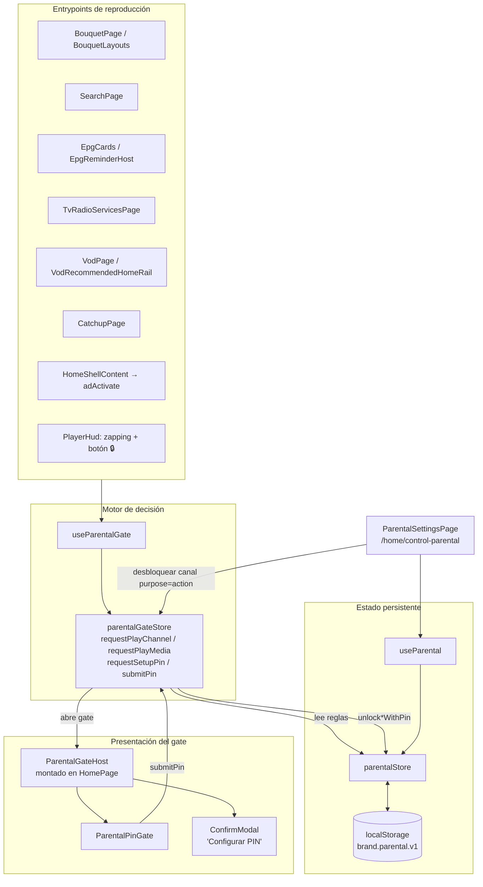
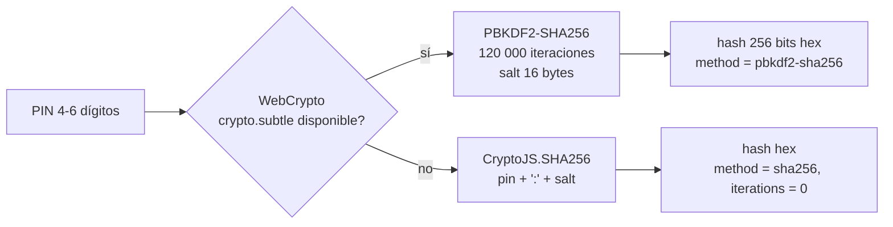
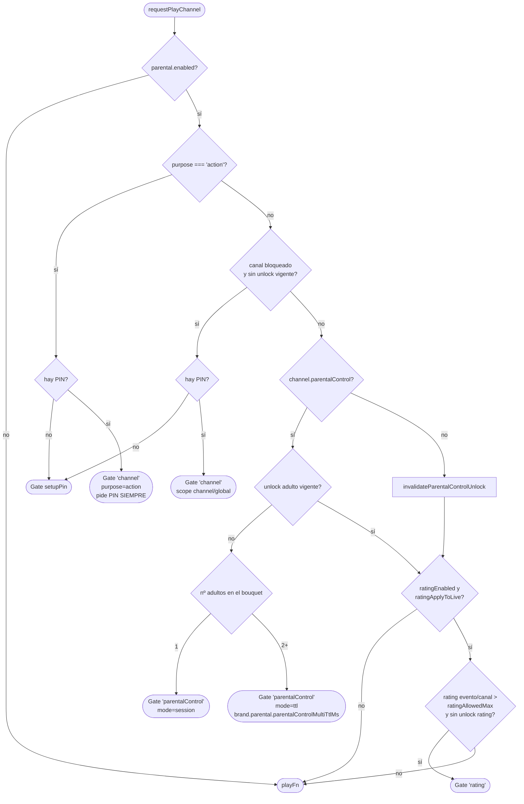

## Control Parental — Arquitectura, flujos y puntos de integración

Este documento describe **cómo está estructurado el Control Parental** en `appVideo` (Web/SmartTV): qué archivos lo componen, cómo se guarda el estado, qué reglas deciden si se pide PIN antes de reproducir, desde qué pantallas se invoca y qué puntos débiles conviene conocer antes de modificarlo.

> Todas las rutas son relativas a la raíz del repo. Las referencias `archivo:línea` corresponden al estado del código en `main` (commit `54691bf`).

---

## 1. Resumen funcional

El control parental ofrece **tres mecanismos de restricción independientes**, todos protegidos por un mismo **PIN local** (4–6 dígitos):

| Mecanismo | Qué restringe | Quién lo configura | Aplica a |
|---|---|---|---|
| **Bloqueo por canal** | Canales concretos marcados por el usuario (lista `blockedChannelIds`) | Usuario, en *Configuración → Control parental* o con el botón 🔒 del Player | TV en vivo |
| **Clasificación indicativa (BR)** | Contenido con clasificación mayor a “Permitir hasta” (L, 10, 12, 14, 16, 18) | Usuario, en *Configuración → Control parental* | VOD, Catchup y (opcional) TV en vivo |
| **Contenido adulto (`parentalControl: true`)** | Canales que el backend marca con `parentalControl`/`parental_control` | Backend (metadata del canal) | TV en vivo |

Principios de diseño:

- **Los canales bloqueados no se ocultan**: se muestran opacados y con candado; al intentar reproducirlos se pide el PIN.
- **Nunca se guarda el PIN en claro**: se almacena un hash PBKDF2‑SHA256 con salt (fallback SHA‑256).
- **Todo es local al dispositivo y a la marca**: no hay sincronización con backend; el estado vive en `localStorage` con prefijo de marca y se borra al cerrar sesión.
- **Un único gate global**: cualquier pantalla que quiera reproducir llama al mismo store (`parentalGateStore`), y un único host (`ParentalGateHost`, montado en `HomePage`) pinta el modal de PIN.

---

## 2. Mapa de archivos

```
src/
├── store/
│   ├── parentalStore.js          # Estado persistente: enabled, PIN (hash), canales bloqueados, rating, unlocks
│   ├── parentalGateStore.js      # Motor de decisión: ¿se reproduce directo o se abre el modal de PIN?
│   └── useParental.js            # Hook de lectura/acciones sobre parentalStore (selectores Zustand)
├── hooks/
│   └── useParentalGate.js        # Hook de acceso a parentalGateStore (entrypoints + host)
├── components/parental/
│   ├── ParentalGateHost.jsx      # Host global del gate (modal PIN / modal "configura tu PIN")
│   ├── ParentalPinGate.jsx       # Modal de PIN con teclado numérico (TV + web)
│   └── ParentalChannelCard.jsx   # Tarjeta de canal en la grilla de configuración
├── pages/
│   └── ParentalSettingsPage.jsx  # Pantalla /home/control-parental
├── utils/
│   ├── pinHash.js                # derivePinHash (PBKDF2 / SHA-256) + timingSafeEqual
│   ├── parentalRatingBR.js       # Normalización de clasificación indicativa Brasil
│   ├── brandStorage.js           # localStorage namespaced por marca ({brand}.parental.v1)
│   ├── brandLogout.js            # resetOnLogout de stores por marca
│   └── homeShellOverlays.js      # Selector .parental-pin-overlay para prioridad de BACK
├── config/
│   ├── brands.js                 # Doc/overrides por marca: parental.parentalControlMultiTtlMs
│   └── brandConfig.js            # Default de parentalControlMultiTtlMs (40 min)
├── styles/pages/_parental.scss   # Estilos de la página, tarjetas y modal PIN (importado global en main.scss)
└── locales/{es,en,pt}.json       # Claves i18n `parental.*` (39) y `pinGate.*` (7)
```

### Diagrama de capas



---

## 3. Estado persistente — `src/store/parentalStore.js`

Store Zustand que concentra **toda la configuración y los desbloqueos temporales**.

### 3.1 Forma del estado

| Campo | Tipo | Default | Persistido | Descripción |
|---|---|---|---|---|
| `enabled` | `boolean` | `false` | ✅ | Interruptor maestro. Si es `false`, el gate deja pasar todo. |
| `pinHash` | `string \| null` | `null` | ✅ | Hash hex del PIN. |
| `pinSalt` | `string \| null` | `null` | ✅ | Salt hex (16 bytes). |
| `pinMethod` | `string \| null` | `null` | ✅ | `'pbkdf2-sha256'` o `'sha256'` (fallback). |
| `pinIterations` | `number` | `0` | ✅ | Iteraciones PBKDF2 (120 000) o `0` en fallback. |
| `blockedChannelIds` | `string[]` | `[]` | ✅ | IDs estables de canales bloqueados (`getChannelStableId`). |
| `unlockUntilMs` | `number \| null` | `null` | ✅ | Fin del desbloqueo temporal de canales bloqueados. |
| `lastUnlockScope` | `'global' \| 'channel' \| null` | `null` | ✅ | Alcance del desbloqueo vigente. |
| `lastUnlockedChannelId` | `string \| null` | `null` | ✅ | Canal desbloqueado cuando el scope es `'channel'`. |
| `ratingEnabled` | `boolean` | `false` | ✅ | Filtro por clasificación activo. |
| `ratingAllowedMax` | `0\|10\|12\|14\|16\|18` | `18` | ✅ | “Permitir hasta”. Valores fuera de la lista se fuerzan a `18`. |
| `ratingApplyToLive` | `boolean` | `true` | ✅ | Aplicar el filtro de rating también a TV en vivo. |
| `ratingUnlockUntilMs` | `number \| null` | `null` | ✅ | Fin del desbloqueo temporal por rating. |
| `pcUnlockUntilMs` | `number \| null` | `null` | ❌ (solo sesión) | Desbloqueo TTL de contenido adulto (bouquet con 2+ adultos). |
| `pcUnlockSessionActive` | `boolean` | `false` | ❌ (solo sesión) | Desbloqueo “sin límite” de contenido adulto (bouquet con 1 adulto). |

### 3.2 Persistencia

- Clave: `` `${brandId}.parental.v1` `` vía `getBrandItem` / `setBrandItem` (`src/utils/brandStorage.js`).
- Formato: JSON con `version: 1`. Si la versión no coincide o el JSON es inválido, `hydrate()` resetea a `initial`.
- `persist()` se ejecuta en `queueMicrotask` después de cada acción mutadora.
- Los campos `pc*` **no se persisten** a propósito (comentario en el store: “por seguridad, este unlock es solo de sesión”).

**Hidratación**

1. Al crear el store (`queueMicrotask(() => hydrate())`), best‑effort.
2. Cuando `BrandContext` termina de cargar la marca (`src/contexts/BrandContext.jsx:96`), para leer con el prefijo de marca correcto.

**Reset al cerrar sesión**

`setLoggedOut()` (`src/utils/userSession.js`) → `clearBrandStorage()` borra todas las claves `{brand}.*` (incluida la del parental) → `resetBrandStoresOnLogout()` (`src/utils/brandLogout.js`) → `parentalStore.resetOnLogout()` deja el estado en memoria en `initial`.

### 3.3 Constantes de tiempo

| Constante | Valor | Uso |
|---|---|---|
| `DEFAULT_UNLOCK_TTL_MS` | 15 min | Desbloqueo de canal bloqueado |
| `DEFAULT_RATING_UNLOCK_TTL_MS` | 15 min | Desbloqueo por rating |
| `DEFAULT_PARENTALCONTROL_MULTI_TTL_MS` | 40 min | Desbloqueo adulto multi‑canal (sobreescribible por marca) |

### 3.4 API del store

**Configuración**

| Acción | Efecto |
|---|---|
| `setEnabled(bool)` | Activa/desactiva. Al **desactivar** invalida todos los unlocks (canal, rating, adulto). |
| `setRatingEnabled(bool)` | Activa/desactiva el filtro por clasificación. |
| `setRatingAllowedMax(n)` | Fija el límite (acepta solo 0/10/12/14/16/18). |
| `setRatingApplyToLive(bool)` | Aplica el rating a TV en vivo. |

**PIN**

| Acción | Efecto |
|---|---|
| `hasPinConfigured()` | `true` si existen `pinHash` y `pinSalt`. |
| `setPin(pin)` | Genera salt + hash y **invalida todos los unlocks**. No valida longitud (lo hace la página). |
| `verifyPin(pin)` | Re‑deriva con el salt guardado y compara con `timingSafeEqual`. |

**Canales bloqueados**

| Acción | Efecto |
|---|---|
| `isChannelBlocked(id)` | Pertenencia a `blockedChannelIds`. |
| `toggleBlock(id)` | Alterna. Si **bloquea**, invalida el unlock de canal vigente (para que un unlock global no “salte” el nuevo bloqueo). |
| `blockChannel(id)` / `unblockChannel(id)` | Versiones explícitas (no usadas actualmente por la UI). |

**Desbloqueos temporales**

| Acción | Efecto |
|---|---|
| `isUnlockedFor(channelId)` | Unlock de canal vigente y (scope global **o** mismo canal). |
| `unlockWithPin(pin, { scope, channelId, ttlMs })` | Verifica PIN y abre ventana de 15 min. |
| `isRatingUnlocked()` / `unlockRatingWithPin(pin, { ttlMs })` | Ídem para rating (global, 15 min). |
| `isParentalControlUnlocked()` | `pcUnlockSessionActive` o `pcUnlockUntilMs` vigente. |
| `unlockParentalControlWithPin(pin, { mode, ttlMs })` | `mode: 'session'` → sin límite en la sesión; `mode: 'ttl'` → ventana configurable. |
| `invalidateParentalControlUnlock()` | Anula el unlock adulto (se llama al reproducir un canal no adulto). |
| `lockNow()` | Anula **todos** los unlocks (botón “Bloquear ahora”). |

`src/store/useParental.js` expone estos mismos valores y acciones como selectores individuales para componentes React.

---

## 4. Seguridad del PIN — `src/utils/pinHash.js`



- **Salt**: `crypto.getRandomValues` (16 bytes). En TVs sin esa API se degrada a `Math.random` (salt débil, pero el PIN sigue sin guardarse en claro).
- **Comparación**: `timingSafeEqual` compara carácter a carácter con XOR acumulado para no filtrar por tiempo.
- `crypto-js` se importa dinámicamente solo si hace falta el fallback.

---

## 5. Clasificación indicativa — `src/utils/parentalRatingBR.js`

`normalizeBrParentalRating(raw)` convierte lo que envíe el backend a `0 | 10 | 12 | 14 | 16 | 18 | null`:

| Entrada | Salida |
|---|---|
| `0`, `"L"`, `"AL"` | `0` (Livre) |
| `10`, `12`, `14`, `16`, `18` (number) | el mismo valor |
| `"A10"` … `"A18"` | 10 … 18 |
| `"14"`, `"+16"`, `"16+"`, `"rating:14"` | se extraen 2 dígitos |
| cualquier otra cosa / `null` | `null` → **no restringe** |

`formatBrRatingLabel(value)` devuelve `"L"` o el número como texto.

**Regla de bloqueo**: se pide PIN si `rating != null && rating > ratingAllowedMax` y no hay un unlock de rating vigente. Contenido **sin rating** o con rating no reconocido **siempre pasa**.

**Origen del rating** (no hay mapeo en `services/`; se usan los campos crudos del backend):

| Tipo | Campo leído |
|---|---|
| TV en vivo | `parentalRating`/`parental_rating` del **evento EPG actual** (`getCurrentEpgEvent(channel.epgItems)`); si no existe, el del canal |
| VOD | `item.parentalRating` |
| Catchup | `event.parentalRating` (en `catchupEvent.js` se hereda de `group.parentalRating`) |
| Búsqueda | `item.raw.parentalRating` / `item.parentalRating` / `raw.event.parentalRating` |

---

## 6. Motor de decisión — `src/store/parentalGateStore.js`

Store Zustand **global y único** (por eso `useParentalGate` es solo un wrapper: el host y los entrypoints deben ver el mismo estado).

### 6.1 Estado del gate

| Campo | Valores | Descripción |
|---|---|---|
| `open` | `boolean` | Hay un gate abierto. |
| `channel` | objeto | Canal o ítem que se intenta reproducir. |
| `playFn` | `Function` | Callback que se ejecuta si el PIN es válido. |
| `title`, `message` | `string` | Textos del modal. |
| `gateKind` | `'channel' \| 'rating' \| 'parentalControl' \| 'setupPin'` | Qué regla disparó el gate. |
| `purpose` | `'playback' \| 'action'` | Reproducir vs. acción administrativa (p. ej. desbloquear un canal). |
| `unlockScope` | `'channel' \| 'global'` | Alcance del unlock para `gateKind: 'channel'`. |
| `pcUnlockMode` / `pcUnlockTtlMs` | `'session' \| 'ttl'` / ms | Modo del unlock adulto. |
| `lastFocusedEl` | `Element` | Elemento con foco antes de abrir; se restaura en `closeGate()` (clave para navegación TV). |

### 6.2 `requestPlayChannel` (TV en vivo)

Firma: `requestPlayChannel({ channel, playFn, title?, message?, purpose?, unlockScope? })`



Orden de prioridad: **acción administrativa → canal bloqueado → contenido adulto → rating**.

Detalles relevantes:

- **Contenido adulto**: el flag se lee de `channel.parentalControl ?? channel.parental_control` y admite `true`, `1`, `'1'`, `'true'`. `getAdultCountInBouquet` busca en `preloadStore.epg.bouquetsWithChannels` el **primer bouquet** que contiene al canal y cuenta cuántos de sus ítems son adultos.
  - 1 adulto → unlock de **sesión** (sin TTL).
  - 2+ adultos → unlock **global con TTL** (default 40 min, configurable por marca).
  - En ambos casos, **reproducir un canal no adulto invalida el unlock adulto**.
- Si el canal está bloqueado y **no hay PIN** configurado, no se reproduce: se abre el gate `setupPin`, que ofrece ir a *Configurar PIN*.

### 6.3 `requestPlayMedia` (VOD / Catchup)

Firma: `requestPlayMedia({ item, ratingRaw, playFn, title?, message? })`

Solo evalúa **clasificación**:

1. `enabled === false` → reproduce.
2. **Sin PIN configurado** → reproduce (a diferencia de `requestPlayChannel`, aquí no se exige configurar PIN).
3. `ratingEnabled !== true` → reproduce.
4. `normalizeBrParentalRating(ratingRaw ?? item.parentalRating)` > `ratingAllowedMax` y sin unlock de rating → abre gate `'rating'`.
5. En otro caso reproduce.

`ratingApplyToLive` **no** afecta a VOD/Catchup: el rating siempre aplica ahí cuando está activo.

### 6.4 `submitPin(pin)`

| `purpose` / `gateKind` | Acción sobre `parentalStore` | Unlock resultante |
|---|---|---|
| `action` | `verifyPin` | Ninguno (solo valida y ejecuta `playFn`) |
| `playback` + `rating` | `unlockRatingWithPin` | Rating global 15 min |
| `playback` + `parentalControl` | `unlockParentalControlWithPin({ mode, ttlMs })` | Sesión o TTL |
| `playback` + `channel` | `unlockWithPin({ scope, channelId })` | Canal (o global) 15 min |

Si el PIN es válido: `closeGate()` (restaura foco) **y después** `playFn()`. Si no, devuelve `false` y el modal muestra “PIN incorrecto”.

### 6.5 `requestSetupPin` y `closeGate`

- `requestSetupPin({ title, message, channel })` abre el gate con `gateKind: 'setupPin'` (se renderiza como `ConfirmModal`, no como teclado).
- `closeGate()` resetea el estado y devuelve el foco a `lastFocusedEl` con `preventScroll`.

---

## 7. Componentes de UI

### 7.1 `ParentalGateHost` — `src/components/parental/ParentalGateHost.jsx`

Montado **una sola vez** en `src/pages/HomePage.jsx:141`. Según `gateKind`:

- `setupPin` → `ConfirmModal` (“Configurar PIN” / “Cerrar”). Al confirmar: cierra el gate, **cierra el player** (HomePage oculta la UI cuando hay reproducción) y navega a `/home/control-parental`.
- Resto → `ParentalPinGate` con `onSubmit={submitPin}` y `onCancel={closeGate}`.
- Título por defecto: `"Canal bloqueado: <nombre>"` si el gate no trae título.

> Como el host vive dentro de `HomePage`, solo hay gate en las rutas `/home/*`. Cualquier entrypoint nuevo fuera de ese árbol necesitaría su propio host.

### 7.2 `ParentalPinGate` — `src/components/parental/ParentalPinGate.jsx`

Modal presentacional reutilizable (lo usan el host y la página de ajustes):

- `<input type="password" inputMode="numeric">` que filtra a dígitos y limita a **6**.
- Teclado numérico en pantalla (0–9, ⌫, OK) para control remoto.
- En TV (`useDevice().isTV`) el input tiene `tabIndex=-1`: se opera con el teclado en pantalla.
- Listener de `keydown` en **fase de captura**:
  - BACK: `Backspace`, `Escape`, `Back`, `Return`, `GoBack`, `BrowserBack`, keyCodes `8`, `27`, `10009` (Tizen), `461` (webOS) → `onCancel`.
  - ENTER: `Enter`, keyCodes `13`, `29443` (Tizen) → submit.
- Raíz `.parental-pin-overlay[role="dialog"]`: `src/utils/homeShellOverlays.js` la usa para que `HomeInputDispatcher` ceda BACK/LRUD al modal mientras está abierto.

### 7.3 `ParentalChannelCard` — `src/components/parental/ParentalChannelCard.jsx`

Botón con logo (prioridad `logo2id` → `/cdn/public/images/{logo2id}/v/thumb.png`, luego `img`/`imageUrl`/`logoUrl`/`logo`/`icon`, luego placeholder de marca), LCN, nombre y 🔒 si `blocked`. Fallback de imagen en `onError`.

### 7.4 `ParentalSettingsPage` — `src/pages/ParentalSettingsPage.jsx`

Ruta: `/home/control-parental` (`src/App.jsx:111`), lazy‑loaded y envuelta en `PreloadGate required="epg"` (necesita la lista de canales). Acceso desde *Sidebar → Configuración → Control parental* (`src/components/Sidebar.jsx:634`) o desde el modal `setupPin`.

Secciones:

1. **Activar control parental** — toggle `setEnabled`.
2. **PIN**
   - *Configurar / Cambiar PIN*: flujo de dos pasos con `pinStep`:
     - `'verify-old'` (solo si ya hay PIN) → `verifyPin`.
     - `'set-new'` → valida mínimo 4 dígitos → `setPin`.
   - *Olvidé mi PIN*: modal informativo; no hay reset in‑app (la vía es cerrar sesión, que borra el storage de la marca).
   - *Bloquear ahora*: `lockNow()`.
   - Aviso “Desbloqueo temporal activo” si `unlockUntilMs` está vigente.
3. **Clasificación (BR)** — segmentado *Sin restricciones / L / 10 / 12 / 14 / 16 / 18* (`setRatingEnabled` + `setRatingAllowedMax`) y checkbox *Aplicar a TV en vivo (EPG)*.
4. **Canales** — grilla de `epg.streams` ordenada por LCN:
   - **Bloquear** → `toggleBlock` directo (no pide PIN).
   - **Desbloquear** con parental activo y PIN → `requestPlayChannel({ purpose: 'action', playFn: toggleBlock })`, que pide PIN siempre.

### 7.5 Botón 🔒 del Player — `src/components/player/PlayerHud.jsx:561`

Visible solo en TV en vivo (`isLiveService`), id `PLAYER_FOCUS_IDS.LOCK`:

- **Bloquear** sin PIN → `requestSetupPin`.
- **Bloquear** con PIN → si el parental estaba desactivado lo **activa automáticamente** y hace `toggleBlock`.
- **Desbloquear** con parental activo → gate `purpose: 'action'`.
- El icono refleja `isChannelBlocked` **aunque el parental esté desactivado**.

El zapping con flechas (`usePlayerChannelZapping` → `handleZapToChannel`) también pasa por `requestPlayChannel`, así que no se puede “saltar” el bloqueo cambiando de canal desde el player.

### 7.6 Indicador en bouquets — `src/components/bouquet/BouquetLayouts.jsx:133`

`isBlocked = parental.enabled && isChannelBlocked(id)` → clase `channel-card--blocked` (opacidad 0.7 + grayscale, `src/styles/pages/_bouquet.scss:853`) y 🔒 superpuesto. El canal sigue enfocable y seleccionable.

---

## 8. Puntos de integración (quién llama al gate)

| Pantalla / módulo | Archivo | Función | Contenido |
|---|---|---|---|
| Bouquets | `src/pages/BouquetPage.jsx:82` | `requestPlayChannel` | Live |
| Servicios TV/Radio | `src/pages/TvRadioServicesPage.jsx:63` | `requestPlayChannel` | Live |
| EPG (tarjetas) | `src/components/epg/EpgCards.jsx:185` | `requestPlayChannel` | Live |
| Recordatorio EPG | `src/components/epg/EpgReminderHost.jsx:122` | `requestPlayChannel` | Live |
| Player (zapping + 🔒) | `src/components/player/PlayerHud.jsx:511`, `:584` | `requestPlayChannel`, `requestSetupPin` | Live |
| Búsqueda | `src/pages/SearchPage.jsx:247`, `:290`, `:338`, `:352`, `:372` | ambas | Live / Catchup / VOD |
| VOD | `src/pages/VodPage.jsx:127` | `requestPlayMedia` | VOD |
| VOD recomendados (Home) | `src/components/vod/VodRecommendedHomeRail.jsx:85` | `requestPlayMedia` | VOD |
| Catchup | `src/pages/CatchupPage.jsx:116`, `:148` | `requestPlayMedia` | Catchup |
| Banners/Ads | `src/utils/adActivate.js:88`, `:110` (vía `HomeShellContent.jsx`) | ambas | Live / Catchup |
| Ajustes | `src/pages/ParentalSettingsPage.jsx` | `requestPlayChannel` (`purpose: 'action'`) | Administrativo |

### Cómo integrar un nuevo punto de reproducción

```jsx
import { useParentalGate } from '../hooks/useParentalGate';

const { requestPlayChannel, requestPlayMedia } = useParentalGate();

// TV en vivo
requestPlayChannel({
  channel,                       // debe tener id/epgStreamId/lcn, epgItems y parentalControl si aplica
  playFn: () => play({ type: 'service', id: channel.id, url, item: channel, autoPlay: true }),
});

// VOD / Catchup
requestPlayMedia({
  item,
  ratingRaw: item?.parentalRating,   // pasar el rating real; null = no restringe
  title: t('parental.restrictedTitle'),
  message: t('parental.restrictedMessage'),
  playFn: () => play(params),
});
```

Reglas:

- **Nunca llamar a `play()` directamente** para contenido reproducible por el usuario; siempre envolver en el gate.
- El componente debe estar bajo `HomePage` (donde vive `ParentalGateHost`).
- Pasar `ratingRaw` siempre que el backend lo entregue.

---

## 9. Configuración por marca

`src/config/brandConfig.js` (`enrichConfigWithAssets`) construye `config.parental`:

```js
parental: {
  parentalControlMultiTtlMs: config.parental?.parentalControlMultiTtlMs ?? 40 * 60 * 1000,
  ...(config.parental || {}),
}
```

Para sobreescribir en una marca (`src/config/brands.js`):

```js
parental: {
  parentalControlMultiTtlMs: 20 * 60 * 1000, // 20 minutos
},
```

Actualmente ninguna marca define `parental`, por lo que todas usan 40 minutos. El resto de TTL (15 min) está fijo en `parentalStore.js`.

Relacionado (solo visual, no restringe): `vod.vodDetail.showParentalRating` y `vod.vodDetail.parentalBadgeBorderColor` controlan el badge de clasificación en `VodDetailModal`.

---

## 10. Internacionalización

Claves en `src/locales/{es,en,pt}.json` (las tres con el mismo set):

- `parental.*` (39): `title`, `subtitle`, `enabled`, `statusEnabled`, `statusDisabled`, `setupPinMessage`, `goToSettings`, `pin`, `setPin`, `changePin`, `forgotPin`, `forgotPinTitle`, `forgotPinMessage`, `enterCurrentPin`, `setPinTitle`, `enterNewPin`, `pinMin`, `pinSaved`, `pinError`, `lockNow`, `unlockActive`, `channels`, `noChannels`, `blocked`, `allowed`, `block`, `unblock`, `confirmChangeTitle`, `confirmChangeMessage`, `ratingTitle`, `ratingHint`, `ratingAllowUpTo`, `ratingNoRestrictions`, `ratingLivreShort`, `ratingApplyToLive`, `restrictedTitle`, `restrictedMessage`, `parentalControlMessage`, `channelBlockedTitle`.
- `pinGate.*` (7): `enterPin`, `maskInput`, `wrongPin`, `keypad`, `cancel`, `confirm`, `ok`.

Todas las llamadas usan `defaultValue` en español como respaldo.

---

## 11. Estilos

`src/styles/pages/_parental.scss` se importa globalmente en `src/styles/main.scss:29` (además de en la página), así que el modal PIN tiene estilos aunque la página de ajustes nunca se haya cargado.

| Bloque | Clases |
|---|---|
| Página | `.parental-page`, `.parental-header`, `.parental-card`, `.parental-row`, `.parental-toggle(.active)`, `.parental-btn(--secondary)`, `.parental-msg` |
| Rating | `.parental-rating-controls`, `.parental-rating-segment`, `.parental-rating-segbtn(.active)`, `.parental-rating-checkbox` |
| Grilla | `.parental-channel-grid` (responsive a 1280 y 920 px), `.parental-channel-card(--blocked)`, `__media`, `__img`, `__lock`, `__meta`, `__lcn`, `__name` |
| Modal PIN | `.parental-pin-overlay`, `.parental-pin-card`, `.parental-pin-title`, `.parental-pin-message`, `.parental-pin-input`, `.parental-pin-error`, `.parental-pin-pad`, `.parental-pin-digit(--ok/--action)`, `.parental-pin-actions`, `.parental-pin-cancel`, `.parental-pin-ok` |

---

## 12. Tabla de desbloqueos (resumen)

| Tipo | Se abre con | Duración | Alcance | Persiste recarga | Se invalida con |
|---|---|---|---|---|---|
| Canal bloqueado | PIN en gate `channel` | 15 min | Ese canal (o global si `unlockScope: 'global'`) | ✅ | `lockNow`, `setPin`, desactivar, bloquear otro canal, expiración |
| Rating | PIN en gate `rating` | 15 min | Todo el contenido por rating | ✅ | `lockNow`, `setPin`, desactivar, expiración |
| Adulto (1 en bouquet) | PIN en gate `parentalControl` | Sesión | Contenido adulto | ❌ | Reproducir canal no adulto, `lockNow`, `setPin`, desactivar, recarga |
| Adulto (2+ en bouquet) | PIN en gate `parentalControl` | 40 min (marca) | Contenido adulto | ❌ | Reproducir canal no adulto, `lockNow`, `setPin`, desactivar, recarga, expiración |
| Acción administrativa | PIN en gate `action` | — | Solo esa acción | — | — |

---

## 13. Observaciones y riesgos detectados

Hallazgos de la revisión. No se modificó código; se listan para priorizar.

**Seguridad / bypass**

1. **Se puede desactivar el control parental sin PIN.** En `ParentalSettingsPage`, el toggle llama `setEnabled(!enabled)` directamente, y el segmentado de rating permite elegir *Sin restricciones* o subir el límite sin verificar PIN. Cualquiera con acceso a *Configuración* anula todas las restricciones.
2. **Sin límite de intentos.** `ParentalPinGate` / `verifyPin` no tienen contador ni bloqueo por intentos fallidos; un PIN de 4 dígitos se puede probar por fuerza bruta desde el teclado en pantalla.
3. **Reset por logout.** Cerrar sesión borra el PIN y toda la configuración (es la vía de “Olvidé mi PIN”). Quien conozca las credenciales de la cuenta puede anular el control parental.
4. **Gate de rating sin PIN configurado.** `requestPlayMedia` reproduce si no hay PIN, aunque `ratingEnabled` esté activo; `requestPlayChannel` en cambio exige configurar PIN para canales bloqueados. Comportamiento inconsistente.
5. **Catchup sin rating en algunos caminos.** El autoplay por `location.state` en `CatchupPage.jsx:148` y el ad `catchup_id=` en `adActivate.js:110` pasan `ratingRaw: null` e `item: { catchupId }`, así que el filtro de clasificación nunca se aplica en esos flujos.

**Correctitud**

6. **Fallback SHA‑256 frágil.** `verifyPin` usa `s.pinIterations || 120000` e ignora `pinMethod`: si el PIN se creó con el fallback SHA‑256 y luego `crypto.subtle` está disponible (p. ej. cambio a contexto seguro HTTPS), se deriva con PBKDF2 y el PIN correcto deja de validar. El caso inverso también falla.
7. **Rating en vivo solo al iniciar.** El rating del evento EPG se evalúa al pedir reproducción; si durante la reproducción empieza un programa con clasificación mayor, no se vuelve a pedir PIN.
8. **Conteo de adultos por el primer bouquet.** `getAdultCountInBouquet` usa el primer bouquet que contiene al canal; si el canal está en varios, el modo (sesión vs. TTL) depende del orden de los bouquets.
9. **Indicadores inconsistentes.** Los bouquets solo muestran 🔒 si `enabled`, mientras que el botón del Player muestra el estado bloqueado aunque el parental esté desactivado.

**Limpieza menor**

10. `blockChannel` / `unblockChannel` no se usan; `pendingOldPin` en `ParentalSettingsPage` se guarda pero no se usa (`void pendingOldPin`); las claves i18n `parental.blocked` y `parental.allowed` no aparecen referenciadas en `src/`.

---

## 14. Checklist de pruebas manuales

- [ ] Sin PIN: bloquear canal desde el Player → aparece “Configurar PIN” → navega a ajustes y cierra el player.
- [ ] Configurar PIN (< 4 dígitos rechazado; 4–6 aceptado); cambiar PIN pide el actual.
- [ ] Canal bloqueado + parental activo: desde Bouquet, EPG, Búsqueda, recordatorio EPG y zapping del Player se pide PIN.
- [ ] PIN correcto → reproduce y, durante 15 min, ese canal no vuelve a pedir PIN; otro canal bloqueado sí.
- [ ] “Bloquear ahora” → vuelve a pedir PIN.
- [ ] Rating “Permitir hasta 12”: VOD/Catchup 14+ piden PIN; sin rating reproducen. Con “Aplicar a TV en vivo” marcado, un evento en vivo 16 pide PIN.
- [ ] Canal `parentalControl: true` en bouquet con 1 adulto: PIN una vez por sesión; al pasar a un canal normal y volver, lo pide de nuevo.
- [ ] Bouquet con 2+ adultos: se puede cambiar entre adultos sin PIN durante el TTL de la marca.
- [ ] TV: BACK (Tizen 10009 / webOS 461) cierra el modal y devuelve el foco al elemento previo; ENTER confirma.
- [ ] Logout / login: la configuración parental queda en valores por defecto.
- [ ] Cambio de marca: cada marca mantiene su propia configuración (`{brand}.parental.v1`).
