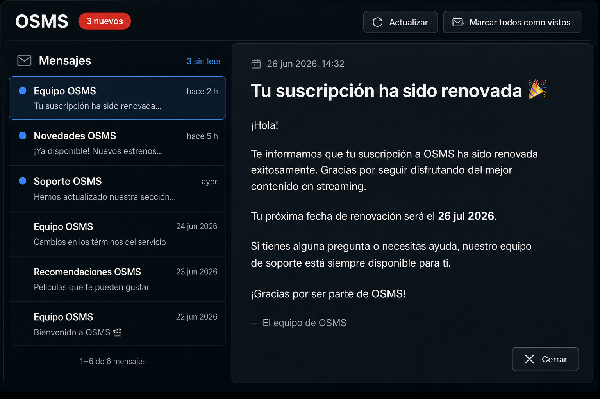
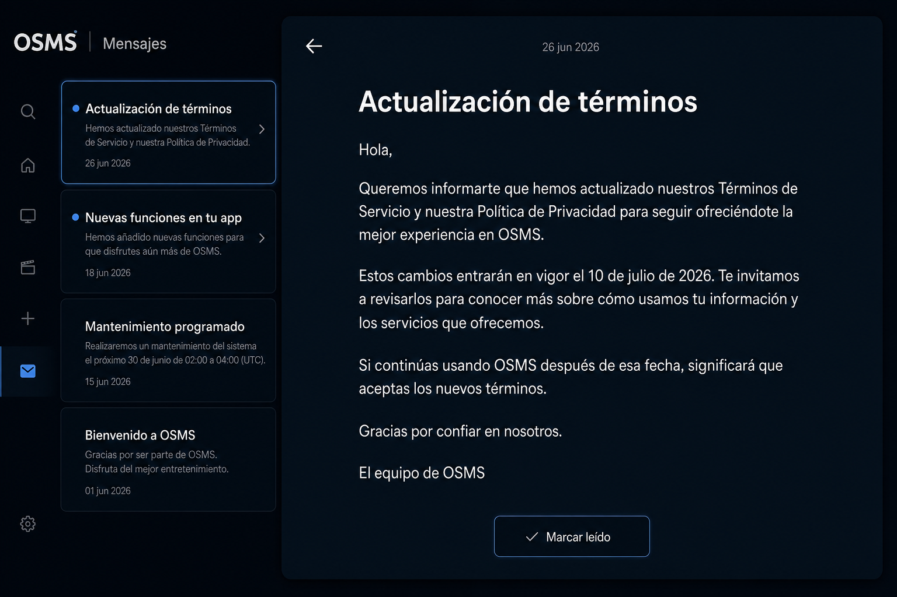
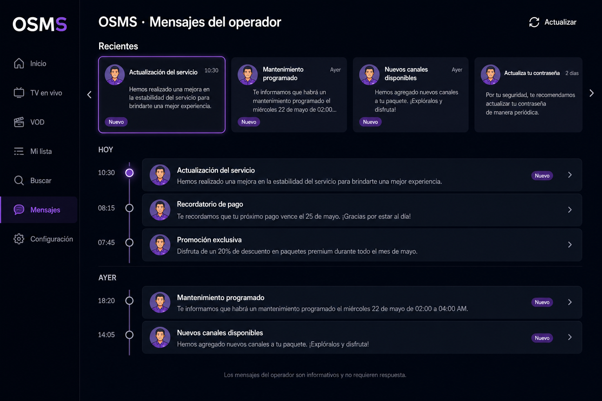

# Propuestas de diseño — OSMS

**Proyecto:** appVideo  
**Fecha:** 2026-06-26  
**Relacionado:** `PLAN_NAVEGACION_TV.md` (§3.5 OSMS), `src/pages/OsmsPage.jsx`, `src/styles/pages/_osms.scss`

---

## 1. Contexto

**OSMS** (Operator Short Message Service) es el módulo de mensajería del operador hacia el usuario final. Los mensajes se obtienen desde Panaccess (`getOsms`), se normalizan a los últimos 30 días y se muestran en la ruta `/home/osms`.

### Datos disponibles por mensaje

| Campo        | Descripción                                      |
|--------------|--------------------------------------------------|
| `id`         | Identificador único del mensaje                  |
| `time`       | Fecha/hora de publicación                        |
| `message`    | Texto del mensaje                                |
| `licenseKey` | Licencia asociada (opcional)                     |

### Estado global (store)

- `items` — lista de mensajes ordenados por fecha descendente
- `unreadCount` / `hasNew` — indicador de mensajes no vistos (badge en sidebar)
- `refreshOsms` / `markAsSeen` — actualizar y marcar como leídos

### Implementación actual

La página usa un layout **master-detail** básico: lista de texto a la izquierda y panel de detalle a la derecha. Funciona, pero carece de jerarquía visual, estados de lectura por mensaje y optimización para navegación con mando (TV).

---

## 2. Objetivo de las propuestas

Definir tres alternativas de diseño para evolucionar `OsmsPage` manteniendo:

- Compatibilidad con el modelo de datos existente
- Soporte web y TV (10-foot)
- Coherencia visual con el resto de la app (tema oscuro, tokens de marca)
- Integración futura con `NavigationRouter` y zonas LRUD

---

## 3. Propuesta 1 — Bandeja de entrada refinada (master-detail)



### Concepto

Evolución directa del layout actual. Mantiene la división lista | detalle, pero con mejor jerarquía tipográfica, indicadores de no leído y fechas relativas.

### Estructura

```
┌─────────────────────────────────────────────────────────────┐
│  OSMS                    [● 3 nuevos]     [↻ Actualizar]    │
├──────────────────────┬──────────────────────────────────────┤
│ ● Mensaje reciente   │  📅 26 jun 2026, 14:32               │
│   Vista previa…      │                                      │
│   hace 2 h           │  Texto completo del mensaje           │
├──────────────────────│  con tipografía grande (18–20px)      │
│   Mensaje anterior   │  e interlineado cómodo.               │
│   Vista previa…      │                                      │
│   ayer               │              [Cerrar]                │
└──────────────────────┴──────────────────────────────────────┘
```

### Elementos de UI

| Zona            | Contenido                                                                 |
|-----------------|---------------------------------------------------------------------------|
| **Header**      | Título, pill “Nuevos”, botones Actualizar y Marcar como vistos          |
| **Lista (35%)** | Punto de color por no leído, preview en 2 líneas, fecha relativa          |
| **Detalle (65%)**| Fecha en cabecera, cuerpo del mensaje legible a distancia, botón Cerrar |

### Navegación TV (LRUD)

1. Fila superior: acciones del header (LEFT/RIGHT)
2. Lista: UP/DOWN entre mensajes
3. ENTER: selecciona y muestra detalle
4. RIGHT (opcional): mueve foco al panel de detalle
5. BACK: deselecciona mensaje

### Ventajas

- Menor esfuerzo de implementación (refactor sobre código existente)
- Funciona bien en escritorio y tablet
- El usuario ya conoce el patrón lista + detalle

### Limitaciones

- En pantallas estrechas el grid se apila y pierde la ventaja del split
- Menos impacto visual que las otras propuestas

### Esfuerzo estimado

**Bajo** — principalmente cambios en `_osms.scss` y pequeños ajustes en `OsmsPage.jsx`.

---

## 4. Propuesta 2 — Feed de tarjetas + modal de lectura



### Concepto

Una sola columna de tarjetas apiladas. Al seleccionar un mensaje, se abre un overlay a pantalla casi completa para lectura cómoda (similar a `EpgEventModal` o `ConfirmModal`).

### Estructura

```
┌─────────────────────────────────────────┐
│  OSMS                          [↻]      │
├─────────────────────────────────────────┤
│ ┌─────────────────────────────────────┐ │
│ │ ● 26 jun · 14:32                    │ │
│ │ Mantenimiento programado mañana…    │ │
│ └─────────────────────────────────────┘ │
│ ┌─────────────────────────────────────┐ │
│ │   25 jun · 09:15                    │ │
│ │ Nuevo canal disponible en tu…       │ │
│ └─────────────────────────────────────┘ │
└─────────────────────────────────────────┘

        ↓ ENTER abre overlay ↓

┌─────────────────────────────────────────┐
│  ← Volver          26 jun 2026          │
│ ─────────────────────────────────────── │
│   Texto completo del mensaje            │
│   con ancho máximo ~65ch                │
│              [Marcar leído]             │
└─────────────────────────────────────────┘
```

### Elementos de UI

| Zona              | Contenido                                                              |
|-------------------|------------------------------------------------------------------------|
| **Header**        | Título y botón de actualizar (icono en TV)                             |
| **Feed**          | Tarjetas con borde, sombra al foco, indicador de no leído              |
| **Agrupación**    | Separadores opcionales: “Hoy”, “Ayer”, “Anteriores”                    |
| **Modal lectura** | Overlay oscuro, fecha en cabecera, texto grande, botón Marcar leído    |
| **Empty state**   | Icono de sobre + mensaje “No hay mensajes disponibles”                 |

### Navegación TV (LRUD)

1. UP/DOWN: recorre tarjetas del feed
2. ENTER: abre modal de lectura (zona modal con prioridad alta)
3. BACK: cierra modal y restaura foco en la tarjeta origen
4. Header: foco separado con LEFT desde la primera tarjeta

### Ventajas

- Navegación lineal simple, ideal para mando a distancia
- Lectura óptima a 2–3 m del televisor (texto grande en modal)
- Patrón coherente con modales ya usados en la app
- Responsive: funciona igual en móvil y TV

### Limitaciones

- Requiere nuevo componente modal (`OsmsMessageModal` o similar)
- No se ven lista y detalle simultáneamente

### Esfuerzo estimado

**Medio** — nuevo componente modal, refactor de lista a tarjetas, estilos y zona TV.

---

## 5. Propuesta 3 — Timeline operador + rail de destacados



### Concepto

Inspirado en Catchup (rails horizontales) y EPG. Los mensajes más recientes aparecen en un carril horizontal superior; el historial completo se muestra en una línea de tiempo vertical agrupada por día.

### Estructura

```
┌─────────────────────────────────────────────────────────────┐
│  OSMS · Mensajes del operador              [↻] [✓ Vistos]   │
├─────────────────────────────────────────────────────────────┤
│  Recientes                                                  │
│  ┌────────┐ ┌────────┐ ┌────────┐                            │
│  │ ● Nuevo│ │        │ │        │  →  (rail horizontal)     │
│  │ preview│ │ preview│ │ preview│                            │
│  └────────┘ └────────┘ └────────┘                            │
├─────────────────────────────────────────────────────────────┤
│  HOY                                                        │
│  │ ● 14:32 — Mantenimiento programado…                      │
│  AYER                                                       │
│  │   09:15 — Nuevo canal disponible…                        │
│  │   18:40 — Recordatorio de facturación…                   │
└─────────────────────────────────────────────────────────────┘
```

### Elementos de UI

| Zona               | Contenido                                                                 |
|--------------------|---------------------------------------------------------------------------|
| **Header**         | Título descriptivo, acciones de actualizar y marcar vistos                |
| **Rail “Recientes”**| 3–5 cards horizontales (reutilizar `EmblaHorizontalRail`)               |
| **Timeline**       | Línea vertical + nodos circulares, agrupación por “Hoy” / “Ayer” / fecha  |
| **Avatar operador**| Logo de marca (`currentBrand`) junto a cada entrada                       |
| **Detalle**        | Expansión inline (acordeón) o panel lateral al seleccionar                |

### Navegación TV (LRUD)

1. DOWN desde header: entra al rail horizontal
2. LEFT/RIGHT en rail; DOWN: baja al timeline
3. UP/DOWN en timeline; ENTER: expande mensaje o abre detalle
4. Requiere modelo de navegación en dos zonas (rail + lista)

### Ventajas

- Identidad visual fuerte; OSMS se siente parte del ecosistema de contenido
- Escaneo rápido de mensajes nuevos en el rail
- Coherente con Bouquet y Catchup

### Limitaciones

- Mayor complejidad de implementación y de navegación TV
- Dos patrones de scroll (horizontal + vertical) pueden confundir en TV
- Requiere más componentes nuevos

### Esfuerzo estimado

**Alto** — rail Embla, timeline, agrupación por fecha, doble zona LRUD.

---

## 6. Comparativa

| Criterio                    | Propuesta 1 | Propuesta 2 | Propuesta 3 |
|-----------------------------|:-----------:|:-----------:|:-----------:|
| Esfuerzo de implementación  | Bajo        | Medio       | Alto        |
| Navegación TV (LRUD)        | Buena       | Muy buena   | Media       |
| Lectura a distancia (TV)    | Buena       | Muy buena   | Buena       |
| Coherencia con la app       | Neutral     | Alta        | Muy alta    |
| Responsive / móvil          | Regular     | Muy buena   | Regular     |
| Impacto visual              | Moderado    | Alto        | Muy alto    |
| Reutiliza código actual     | Sí          | Parcial     | No          |

---

## 7. Recomendación

| Prioridad              | Propuesta recomendada | Motivo                                                                 |
|------------------------|-----------------------|------------------------------------------------------------------------|
| Entrega rápida         | **1**                 | Refactor mínimo sobre `OsmsPage` existente                             |
| Navegación TV + UX     | **2**                 | Alineada con `PLAN_NAVEGACION_TV.md` (lista → ENTER → detalle/modal) |
| Identidad de producto  | **3**                 | Máxima coherencia con rails de Catchup/Bouquet                         |

**Recomendación general:** **Propuesta 2** para producción TV, por equilibrio entre experiencia de lectura, simplicidad de foco y patrones ya usados en la app.

---

## 8. Próximos pasos (cuando se elija diseño)

1. Actualizar `OsmsPage.jsx` y `_osms.scss` (o crear componentes dedicados)
2. Añadir claves i18n si hace falta (fechas relativas, agrupaciones, etc.)
3. Registrar zona `osmsZone` en `NavigationRouter` según `PLAN_NAVEGACION_TV.md`
4. Validar con checklist TV: foco inicial, BACK restaura foco, scroll instantáneo
5. Probar con marca que tenga `features.osms: true` (p. ej. en `brands.js`)

---

## 9. Referencias de código

| Archivo                         | Rol                                      |
|---------------------------------|------------------------------------------|
| `src/pages/OsmsPage.jsx`        | Página principal                         |
| `src/styles/pages/_osms.scss`   | Estilos actuales                         |
| `src/store/osmsStore.js`        | Estado, polling, no leídos               |
| `src/services/osmsService.js`   | Fetch y normalización                    |
| `src/hooks/useOsmsPolling.js`   | Polling en background                    |
| `src/components/Sidebar.jsx`    | Entrada de menú + badge                  |
| `docs/PLAN_NAVEGACION_TV.md`    | §3.5 — requisitos de navegación TV       |
